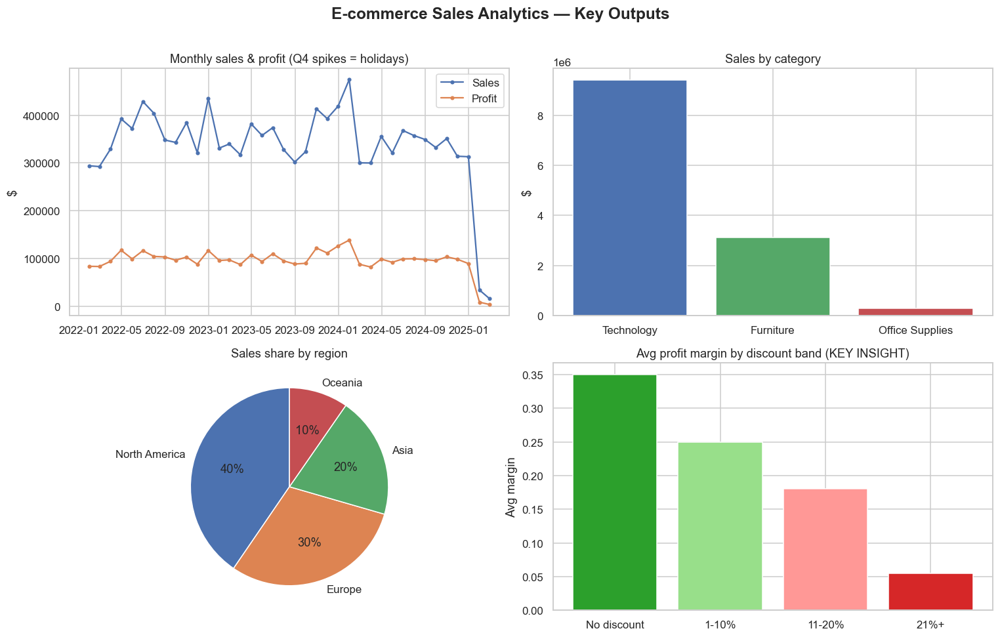

# 📊 E-commerce Sales Analytics

[](https://github.com/Tejaswini-Bollikonda/ecommerce-sales-analytics/actions/workflows/ci.yml)
[](https://www.python.org/)
[](LICENSE)

An **end-to-end data analysis project** — from raw, messy data to an interactive
dashboard — built with Python, pandas, and Streamlit. It analyses three years of
synthetic online-retail orders to answer real business questions: *Where does our
revenue come from? Is our discounting strategy actually profitable? Who are our
most valuable customers?*

> Synthetic data is generated locally, so the whole project runs anywhere with
> **no downloads or API keys**.



---

## ✨ What this demonstrates

| Skill | Where to look |
|-------|---------------|
| Data cleaning & wrangling | [`src/data_prep.py`](src/data_prep.py) |
| Reusable analysis logic (KPIs, aggregations) | [`src/analysis.py`](src/analysis.py) |
| Exploratory data analysis & storytelling | [`notebooks/01_exploratory_analysis.ipynb`](notebooks/01_exploratory_analysis.ipynb) |
| Interactive dashboarding | [`app.py`](app.py) |
| Reproducible, well-structured code | project layout below |

---

## 🚀 Quick start

```bash
# 1. Clone and enter the project
git clone https://github.com/<your-username>/ecommerce-sales-analytics.git
cd ecommerce-sales-analytics

# 2. (Recommended) create a virtual environment
python -m venv .venv
source .venv/bin/activate        # Windows: .venv\Scripts\activate

# 3. Install dependencies
pip install -r requirements.txt

# 4. Generate the sample dataset
python data/generate_data.py

# 5a. Explore in the notebook...
jupyter notebook notebooks/01_exploratory_analysis.ipynb

# 5b. ...or launch the interactive dashboard
streamlit run app.py
```

---

## 🗂️ Project structure

```
ecommerce-sales-analytics/
├── app.py                     # Streamlit dashboard
├── requirements.txt
├── data/
│   └── generate_data.py       # Creates realistic, intentionally-messy sample data
├── src/
│   ├── data_prep.py           # Load + clean pipeline
│   └── analysis.py            # KPIs and aggregations (shared by notebook & app)
└── notebooks/
    └── 01_exploratory_analysis.ipynb   # The EDA narrative
```

The same functions in `src/` power **both** the notebook and the dashboard, so the
numbers never drift between your report and your app.

---

## 🔍 Key findings

- **Seasonality** — sales climb every Q4 with holiday demand.
- **Category mix** — Technology drives the most revenue; Office Supplies is
  high-volume but low-value.
- **Discounting erodes profit** — average margin drops sharply beyond ~20%
  discount, with the deepest band flirting with losses.
- **Customer concentration** — a small share of customers drives a large share of
  revenue, pointing to a clear retention opportunity.

---

## ✅ Tests

Unit tests cover the cleaning pipeline and every analysis function:

```bash
pip install -r requirements-dev.txt
pytest -q
```

They run automatically on every push via **GitHub Actions** (see the CI badge above).

## 🛠️ Built with

`pandas` · `numpy` · `matplotlib` / `seaborn` · `plotly` · `streamlit` · `pytest`

## 📄 License

MIT — feel free to fork and adapt. See [LICENSE](LICENSE).
